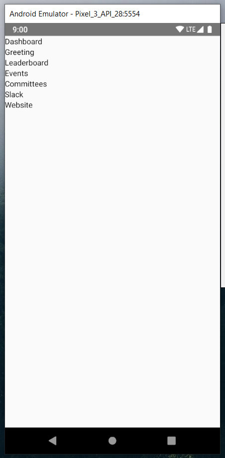

If you are here, you already have your environment set up and can start coding. If you don't know what I'm talking about, check [Getting Started](/getting-started).
{: .notice--warning}

In Part 1, we will start with making our first screen. Here, multiple things will be introduced: components, 

## Exercise 1
**TLDR;** Create a react-native app and make a custom screen (this will be explained later).
{: .notice}
You can create a new react-native app with the command
```
npx react-native init <nameOfProject>
```
This creates the project in the directory "nameOfProject." Inside, you will find multiple files/folders (you will find more, but we only care about a few):

| App.js 		| File where app development takes place. Everything here is to be rendered. 					|
| android 		| Android project 																								|
| ios 			| Xcode project for iOS devices 																				|
| index.js 		| Entry point (aka root file) for react-native app. This is where code begins execution.  |
| node_modules | Folder with all dependencies being used on the project. 											|
| package.json | Lists all dependencies installed for your project. 													|

Run your emulator to see what react-native cli made. Once there, you can edit `App.js` to have your own custom screen. However, it would be better to start from scratch, so delete the contents of `App.js`. The reason for this is that the project creator implements code differently than how we code our app. The general structure of files is the following, lets break it down.

```js
1  import React from 'react';
2  import { Component } from 'react'; 
3  import { View, Text } from 'react-native';
4
5  class App extends Component
6  {
7    render()
8    {
9      return (
10       <View>
11         <Text>Hello, world!</Text>
12       </View>
13     ) 
14   }
15 }
16
17 export default App;
```

This is the general structure your files will have in react-native...
* **line 1**: import statement to use the React library
* **line 2**: import the React component to be extended. This is so we can write `extends Component` instead of `extends React.Component`.

We can have these statements in a single line, like so  
`import React, { Component } from 'react'`
{: .notice--info}

* **line 3**: import [react-native components](https://facebook.github.io/react-native/docs/activityindicator) to be used in the render method.
We will go more in-depth on imports/exports later, but you are free to search for default and named imports/exports online.
* **line 5**: definition of class that extends from the [React base component](https://reactjs.org/docs/react-api.html#reactcomponent)
* **line 7**: required method for any component class. Returns elements to be displayed and can be used for fancier coding before returning.
* **lines 9-13**: [JSX elements](https://reactjs.org/docs/introducing-jsx.html) to be returned (aka rendered, displayed) to the app.
* **line 17**: exports the current class to be used in other parts, such as `index.js`.

**What are components?**  
Components let you split the [User Interface] into independent, reusable pieces, and think about each piece in isolation." _from [ReactJS](https://reactjs.org/docs/components-and-props.html)_
{: .notice--info}

If you run this is an emulator, you will see a very simple screen that says "Hello, world!" (or anything else that you may have written).

For the next exercises, let's build a screen similar to the Dashboard from the SHPE App.

## Exercise 2
**TLDR;** Replace App.js with the bare bones of the Dashboard screen in the SHPE app.
{: .notice}
Create a new file (it can be named whatever you want, although _Dashboard_ sounds nice) and use the same structure we did in [Exercise 1](#exercise-1).

The Dashboard on the app is more complicated than what we made previously. This is where we have to use [React Native components](https://facebook.github.io/react-native/docs/activityindicator) - although we have already used two of them: `View` and `Text`.
On the [React Native Docs](https://facebook.github.io/react-native/docs/activityindicator), you will see all components that are provided to us, which can be imported `from 'react-native'`, as [Exercise 1](#exercise-1) did in line 3.

Additionally, you will see that we have to include some styling to have the <span style="color: black">black</span>/<span style="color: yellow">yellow</span>/<span style="color: gray">gray</span> colors on the screen, but we should focus first on the functionality rather than the styling.

Note that React Native requires you to wrap everything inside a parent `<View>` tag, since React can only return one element; e.g.,  
`<View>`  
&nbsp;&nbsp;`// everything...`  
&nbsp;&nbsp;`// totally everything...`  
`</View>`
{: .notice--warning}

1. In App.js, start with making the header (You can remove what we did in Exercise 1). This only consists of a small `View` with bold text. Don't worry about making it bold right now.
1. Then create another `Text` component with the Greeting, these can be hard-coded for now.
1. There are 5 more "blocks": leaderboard, events, committees, Slack, and website. Create these as placeholders using `View`s and `Text`s. They will be filled throughout Part 1.

{: width="30%" .align-center}

_Your emulator screen should look like this. Although this is pretty plain, we already divided the code in order to know what goes where. We are only able to do this because we know what the Dashboard should look like - it would be better to do it in small steps on screens you don't know much about._
{: .notice}

## Exercise 3
**TLDR;** ...
{: .notice}

Let's start filling in the screen you made in [Exercise 2](#exercise-2). For this we will need styling...


## Exercise 4


## Exercise 5


*** 
References  
&nbsp;&nbsp;&nbsp;&nbsp;[Aman Mittal](https://hackernoon.com/getting-started-with-react-native-in-2019-build-your-first-app-a41ebc0617e2)