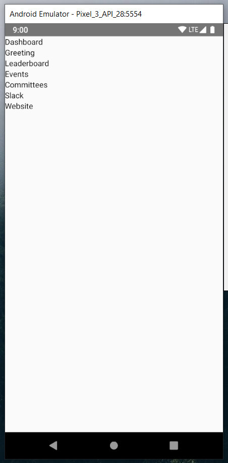
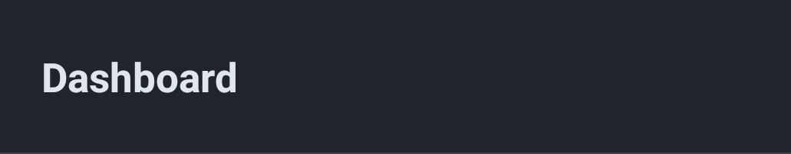

If you are here, you already have your environment set up and can start coding. If you don't know what I'm talking about, check [Getting Started](/getting-started).
{: .notice--danger}

In Part 1, we will start with making our first screen: the Dashboard. Here, multiple things will be introduced: components, ... Throughout the exercises, you will build individual parts of the screen.

## Exercise 1
**TLDR;** Create a react-native app and make a custom screen (this will be explained later).
{: .notice}

To build and run your application using node:
You can create a new react-native app with the command:
```
npx react-native init <nameOfProject>
```
> from [React Native](https://facebook.github.io/react-native/docs/getting-started.html)

To build and run your application using expo, install it with the following command:
```
expo init <nameOfProject>
```
> from [React Native](https://facebook.github.io/react-native/docs/getting-started.html)

**Please make sure that you have your environment set-up; that is, you installed node, an emulator (iOS or Android), and react-native. Double check that you have met these requirements by going to [Getting Started](/getting-started).**
{: .notice--danger}

This creates the project in the directory "nameOfProject." Inside, you will find multiple files/folders (you will find more, but we only care about a few):

| App.js 		   | File where app development takes place. Everything here is to be rendered. 					   |
| android 		 | Android project 																								                         |
| ios 			   | Xcode project for iOS devices 																				                   |
| index.js 		 | Entry point (aka root file) for react-native app. This is where code begins execution.  |
| node_modules | Folder with all dependencies being used on the project. 											           |
| package.json | Lists all dependencies installed for your project. 													           |

If you don't know how to setup your emulator, check out [Getting Started](/getting-started).
{: .notice--warning}

Run your emulator to see what react-native (or expo) made.

| Android                          | iOS                           | Expo                              |
|----------------------------------|-------------------------------|-----------------------------------|
| ``` react-native run-android ``` | ``` react-native run-ios  ``` | ``` npm start # or expo start ``` |

Once there, you can edit `App.js` to have your own custom screen. However, it would be better to start from scratch, so delete the contents of `App.js`. The reason for this is that the project creator implements code differently than how we code our app. Normally, this is how your JavaScript files will look like, lets break it down.

```js
1  import React from "react";
2  import { Component } from "react"; 
3  import { View, Text } from "react-native";
4
5  class App extends Component
6  {
7    render()
8    {
9      return (
10       <View>
11         <Text>Hello, world!</Text>
12       </View>
13     ) 
14   }
15 }
16
17 export default App;
```

This is the general structure your files will have in react-native:
* **line 1**: import statement to use the React library
* **line 2**: import the React component to be extended. This is so we can write `extends Component` instead of `extends React.Component`.

<div class="notice--info" markdown="1">
We can have these statements in a single line, i.e.:

```js
import React, { Component } from "react";
```
</div>

* **line 3**: import [react-native components](https://facebook.github.io/react-native/docs/activityindicator) to be used in the render method.
We will go more in-depth on imports/exports later, but you are free to search for default and named imports/exports online.
* **line 5**: definition of class that extends from the [React base component](https://reactjs.org/docs/react-api.html#reactcomponent)
* **line 7**: required method for any component class. Returns elements to be displayed and can be used for fancier coding before returning.
* **lines 9-13**: [JSX elements](https://reactjs.org/docs/introducing-jsx.html) to be returned (aka rendered, displayed) to the app.
* **line 17**: exports the current class to be used in other parts, such as `index.js`.

**What are components?**  
"Components let you split the [User Interface] into independent, reusable pieces, and think about each piece in isolation." _from [ReactJS](https://reactjs.org/docs/components-and-props.html)_
{: .notice--info}

If you run this is an emulator, you will see a very simple screen that says "Hello, world!" (or anything else that you may have written).

For the next exercises, let's build a screen similar to the Dashboard from the SHPE App.

## Exercise 2
**TLDR;** Replace App.js with the bare bones of the Dashboard screen in the SHPE app.
{: .notice}
Create a new file (it can be named whatever you want, although _Dashboard_ sounds nice) and use the same structure we did in [Exercise 1](#exercise-1).

The Dashboard on the app is more complicated than what we made previously. This is where we have to use [React Native components](https://facebook.github.io/react-native/docs/activityindicator) - although we have already used two of them: `View` and `Text`.
On the [React Native Docs](https://facebook.github.io/react-native/docs/activityindicator), you will see all components that are provided to us, which can be imported `from "react-native"`, as [Exercise 1](#exercise-1) did in line 3.

Additionally, you will see that we have to include some styling to have the <span style="color: black">black</span>/<span style="color: yellow">yellow</span>/<span style="color: gray">gray</span> colors on the screen, but we should focus first on the functionality rather than the styling.

<div class="notice--warning" markdown="1">
Note that React Native requires you to wrap everything inside a parent `<View>` tag, since React can only return one element; e.g.,
```js
<View>
  // everything...
  // totally everything...
</View>
```
</div>

1. In App.js, start with making the header (You can remove what we did in Exercise 1). This only consists of a small `View` with bold text. Don't worry about making it bold right now.
1. Then create another `Text` component with the Greeting, these can be hard-coded for now.
1. There are 5 more "blocks": leaderboard, events, committees, Slack, and website. Create these as placeholders using `View`s and `Text`s. They will be filled throughout Part 1.

{: width="30%" .align-center}

_Your emulator screen should look like this. Although this is pretty plain, we already divided the code in order to know what goes where. We are only able to do this because we know what the Dashboard should look like - it would be better to do it in small steps on screens you don't know much about._
{: style="text-align: center"}

## Exercise 3
**TLDR;** Style the title (or navigation bar) for the Dashboard screen to make it look like the SHPE app.
{: .notice}

Let's start filling in the screen you made in [Exercise 2](#exercise-2). Because we know what the Dashboard screen looks like, we can start placing these blocks in their respective areas (left, right, center...) and add some color or text styling to it. For the most part, we will be hard-coding stuff and will bring functionality by the end of Part 1.

Because we will use styling, we will need styles (!), the [CSS way](https://www.w3schools.com/Css/). React Native allows us to do that in two ways: inline or outside, just like with CSS and HTML.  
For example, if I want to make the text blue, I can do the following: (I encourage you to test this code in App.js)
```js
...
  <Text style={{ color: "#000080" /* navy blue */ }}>
	  I am blue
  </Text>
...
```
However, this can get messy. What if I want to add more styling?
```js
...
  <Text style={{ color: "#FF1493" /* deep-pink */, fontWeight: "bold", textAlign: "center", padding: 10 }}>
	  I am pink, centered, bold, and have a padding of 10 pixels on all sides!
  </Text>
...
```
**Note:** This is slightly different from CSS, if you are familiar with it. Check out fontWeight (instead of font-weight), for example. See [React Native Style](https://facebook.github.io/react-native/docs/style) for more.
{: .notice--info}

And then imagine this being repeated for every other line of code that you write. Not only will you be duplicating styling most of time, but it will be way too cluttered for you to be able to follow your code after you write it.

For this reason, we use a global object called *styles* (by convention) with the [StyleSheet](https://facebook.github.io/react-native/docs/stylesheet.html) component from react-native ([although there appears to be no real difference](https://stackoverflow.com/questions/38958888/react-native-what-is-the-benefit-of-using-stylesheet-vs-a-plain-object) if you use it or not. I won't use it here). With it, we have a global object that contains other objects, the individual styles that we want to apply to different parts of our code.

Now that we know this, we can start making individual styles for the different parts of the Dashboard.

Let's start with the header (or navigation bar): **Dashboard**.
For it, we will need a `View` and `Text` component, that's it.
```js
...
  <View style = { ... }>
    <Text style = { ... }></Text>
  </View>
...
```
What should the styling be, then? If we look at the Dashboard screen, we will see that the navigation bar is really simple, black background with a bold white title, centered vertically.

{: width="45%" .align-center}

To be able to do this, all background styling is placed in the `View` and specific styling to the text in `Text`.

1. Create `styles` as a global constant at the end of App.js, right before the export statement.

	A constant is a variable type, used in JavaScript, such as an `int` in C or Java, except that it cannot be changed after it is declared because it's a constant. In JavaScript (the language we use), variables are loosely-typed, meaning that we can assign anything to them, whereas `int`s only allow for integers. In JS, there's also `let` and `var`, check out more of this [here](https://developer.mozilla.org/en-US/docs/Web/JavaScript/Data_structures).
	{: .notice--info}

2. Inside this object, you can create the name of the styling you want to add. They can be named whatever you want. It will later be accessed using the [dot operator](https://www.w3schools.com/js/js_objects.asp) for objects, e.g. if I create a style called potato, then I can access its styling by writing `styles.potato`. However, it should be something that makes sense to you, such as *tabBar* and *tabBarText*.

	```js
	const styles = {
		tabBar: {
			someStyle: "value",
			anotherStyle: 0
		},
		tabBarText: {
			coolStyle: "#000000"
		}
	}
	```

3. We will need the following styles (and maybe a few more), you can start writing them in:
* backgroundColor: "#21252b"
* color: "#E0E6ED"
* fontSize: 20
* fontWeight: "bold"

4. After writing the styling in the styles `const`, you can tell React Native to use the styling by placing it in the style for `View` and `Text`, as you would inline (*that's 4 styles for ya*).

	```js
	...
		<View style = { styles.tabBar }>
			<Text style = { styles.tabBarText }>Dashboard</Text>
		</View>
	...
	```

	Notice how this time we only used one set of curly braces `{}` to apply styling. And how we "call" it by accessing the `styles` global constant we made at the bottom of the file. This is much cleaner than writing styling inline!

	If you have your emulator running, you will see the screen change as you save your file (assuming you have [Fast Refresh](https://facebook.github.io/react-native/docs/fast-refresh) enabled, found in the newest version of react-native, or [Hot Reloading](https://facebook.github.io/react-native/blog/2016/03/24/introducing-hot-reloading.html#hot-reloading) in older versions). Check out [Getting Started](/getting-started) if you're not sure how to enable it.

5. However, if you check your screen, it doesn't look the same as the SHPE app, the title is all cramped up in the corner. We need to increase the space or size of this container.

	We could use padding, but because we want a fixed size of this bar, not just whitespace, we use the [`height` style](https://developer.mozilla.org/en-US/docs/Web/CSS/height), which only requires a number.

	The problem with setting a random number is that not all phones have the same screen size (if you didn't know), so it may look good on your phone/emulator, but it may be a total catastrophe on another phone. For this reason, we use the `Dimensions` component that [React Native provides](https://facebook.github.io/react-native/docs/dimensions.html#get) and use its `get()` method that returns an object with height and width, among other things. We then access it with the dot property.

	```js
	// Note that I'm not catching any of the values returned, which is bad.
	// I just wanted to show you how to use the Dimensions component.
	// Method 1
	Dimensions.get("window").height;  // device height
	Dimensions.get("window").width;   // device width

	// Or to only call get() once, if you're planning on
	// using it multiple times:
	// Method 2
	const dimension = Dimensions.get("window");
	dimension.height;  // device height;
	dimension.width;   // device width
	```

	Remember that, in order to use this React Native component, you *have* to import it the same way you did with `View` and `Text`, shown in line 3 of [Exercise 1](#exercise-1).
	{: .notice--warning}

	We generally use the second "method" and set `dimension` as a global constant. Anyway, now that we have the height, we can scale it by any constant, which happens to be 0.1 for the navigation bar in the SHPE app - but you can set it to whatever you want, since it's your app!

	```js
	height: dimension.height * 0.1
	```

6. But even then, the title is too close to the left. Now we can use padding. You can choose whatever number you like, we used `"5%"` to make sure it respected each device's width. Check out CSS padding [here](https://www.w3schools.com/csS/css_padding.asp) and React Native docs for padding [here](https://facebook.github.io/react-native/docs/0.36/layout-props#paddingleft).

7. We also have a border on the bottom. It is [similar to CSS as well](https://www.w3schools.com/CSSref/pr_border-bottom.asp), but remember that there are no hyphens, use camelCase instead.

After that, your emulator screen should still be plain, but now with a proper header. Next, we have to style the remaining blocks.

This is actually not the correct way of doing it, but we'll do it like this for now. You'll see why during the next few exercises.
{: .notice--info}

## Exercise 4
**TLDR;** Style the Greeting and add functionality.
{: .notice}

Let's continue finishing up the Dashboard. Now that we did one part, the rest should be similar. 

1. The greeting is simple, just a "hello" and the user's name with the current date. But, we haven't configured anything regarding the database, so we're just gonna [hard code](https://www.reddit.com/r/ProgrammerHumor/comments/9lllxu/hard_coding/) it for now, same with the date. You can write whatever text you want along with the date. We will make it work us by the end of this exercise.
2. Notice that the greeting on the app does not have background itself, it is placed on top of the background of the whole screen. For this we would need to style the outermost `View`. Create a new styling in the `styles` object for this, to keep everything organized.
* backgroundColor: "0c0b0b"
3. Also, this greeting has some whitespace around it, so add padding to the `View` that wraps it.
	Two things happen when you do this:
	* We can't see any of the text (hint: use `color` to change the font color)  
	* The background color only takes ~1/4 of the page
	Let's fix this by adding another style to the outermost `View`, `flex: 1`.
		
	<div class="notice--info" markdown="1">
	**What [flex](https://facebook.github.io/react-native/docs/flexbox.html) does is amazing**, but complicated at first sight. "It makes the component flexible and it will be sized proportional to its flex value" *from [React Native](https://facebook.github.io/react-native/docs/layout-props.html#flex)*.

	`flex: 1` will allow the code to expand the component relative the number given across its main axis. **What is the main axis**, you ask? It is vertical by default, but you can change it with other styling, such as `flex-direction`. For an in-depth explanation of flex, go [here](https://medium.com/the-react-native-log/understanding-react-native-flexbox-layout-7a528200afd4).

	Furthermore, we can combine `flex` with other `flex`s to format the UI however we want. More on that later...
	</div>

Now that the greeting is where it should be, we can add functions to it and get the current date and do some cool stuff to change the greeting depending on *when* the user is logging in. For this, we will use [JavaScript objects](https://www.w3schools.com/js/js_objects.asp) - specifically the [Date object](https://javascript.info/date) to get the current date.

We want to use this object and do some logic and be able to determine the appropriate greeting and display the date appropriately. This can't be done inside the `return` statement because we are also returning the JSX elements to display. We *could* do it in the `render()` function, but this is bad practice. The best way to do this, is to create a separate function inside the `Dashboard` class.

We have different options for the class; it can return:
<ol type="a">
	<li>the current date or time in a specified format,</li>
	<li>an object with the current date and custom text, or</li>
	<li><strong>JSX elements displaying the greeting how we want it</strong>.</li>
</ol>

We choose **c**, since it is the simplest solution. Otherwise, with **a** or **b**, `render()` would need to take care of the styling and formatting of the text. By writing a function that takes care of everything, it simplifies the code in the render function, because we would only need to call the function inside the render's return statement.

By the way, you are already familiar with react native functions, since we've used `render()` everywhere (although they are [slightly different from JavaScript](https://www.w3schools.com/js/js_functions.asp)).

1. Create a function with a name that will let your future-self (or coworkers) know what the function name, such as `generateGreeting() {}` or `greeting() {}`.
2. Inside this function we will have the functionality to get the date and time. For this we need an instance of the [Date object](https://javascript.info/date), as `const date = new Date();`. We create it as a constant so that we (or someone else) don't change its value later on.

3. Create additional variables (for readability) to save the current day, month, and time. Checkout all the available functions for the Date object [here](https://www.tutorialspoint.com/javascript/javascript_date_object.htm). The day and month will be used directly to display text, while `time` will be used for the personalized greeting, depending if the user is opening the application in the morning or afternoon - how?

	  
	*Adding a picture here because there's too much white, lifeless text*.
	{: style="text-align: center"}

4. Using the time, determine the appropriate greeting, i.e., "Good morning", "Good evening", "Buenas noches"... you decide. This will be done using branches, where you are free to use [if..else](https://www.w3schools.com/js/js_if_else.asp) branches or the [ternary operator](https://www.thoughtco.com/javascript-by-example-use-of-the-ternary-operator-2037394), which work the same way as in C or Java (and many other programming languages). You can save this greeting in a separate variable to easily access later when returning the elements.

	There's a problem right now that you may not have noticed if you didn't read through the documentation of the Date object. Right now the function to get the current month returns a number from 0 to 11, not the actual month string.
	
	In order to get and display the month by name, we need to use an array of months, then index it with the value returned by `.getMonth()`. That is, an array with indices ["January", "February", ..., "December"].

5. Let's finally return the JSX elements, since we have everything we need to display it on the screen. Just like in `render()`, return a main `View` component with what you want inside, some `Text`. This text should display the customized greeting and today's day and month.

6. Now that we're done, we can call this function render function inside the render function inside the `View` where we had previous hard-coded the greeting. We can call this function by placing it inside curly braces `{}` so that react native knows we're going to be using JavaScript. That is, we have something like:

	```js
	<View style = { ... }>
	  { this.myFunction() }
	</View>
	```

	**What is** `this` **and what is it doing in my code?** *The simplified version*.
	We will go more in-depth later on.
	{: .notice-info}

If you rebuild your emulator, you will see that the greeting is displayed correctly, but the styling is off. That's because we didn't actually add any styling to the `Text` in our greeting function. You can use the same styling that you used before, so extract that styling and place it in the `View` or `Text` of the return function for `greeting()`.

## Exercise 5
**Let's skip Exercise 5 for today**.
{: .notice}
<!-- ## Exercise 5
**TLDR;** Make the style skeleton of leaderboard and events.
{: .notice}

This and the following "blocks" have a similar style, so we can take this into our advantage and reduce the amount of code that we write.

The rest of the screen, because it doesn't have any functionality *yet* (~~even in the most updated version~~ **it has been included in version 1.1**, which was released January 22, 2020), is simpler to code up since we only have to worry about styling, for the most part. -->

## Exercise 6
**TLDR;** Finishing the rest of the screen.
{: .notice}

1. Add styling for **Committees** to make it have rounded corners, centered, and bold. Take into account the styles for its `View` vs `Text`.
* backgroundColor: "#21252b"
* borderRadius: 10
* padding: "3%"
* margin: "3%"

	Generally, style for specific stuff, such as fontSize, color, and centering lies on the inner tags of the `View`. The background styling, such as backgroundColor, vertical spacing, and direction (making stuff in columns) lies on the `View` itself that wraps the specific content.
	{: .notice--info}

2. (Optional) Add `Text` for the "Coming Soon!" and its respective styling.
3. Continue with the **Slack** styling. Here we will use a third-party module. You can style this the same you did for **Committees** using step 1.

	<div class="notice--info" markdown="1">
	**What is a module?**  
	"Sometimes an app needs to access a platform API and React Native doesn't have a corresponding module yet. [...] If React Native doesn't support a native feature that you need, you should be able to build it yourself." *from React Native [iOS](https://facebook.github.io/react-native/docs/native-modules-ios.html) and [Android](https://facebook.github.io/react-native/docs/native-modules-android)*.  
	
	It is a library with JavaScript code that serves the purpose of providing us with a feature, be it UI, animations, networks, widgets, etc. so that we only have to install it and then import it into whichever part of our app we want it in.
	</div>

	We want to use module called [FontAwesome](https://github.com/oblador/react-native-vector-icons). With it, we use the [FontAwesome database](https://oblador.github.io/react-native-vector-icons/) to look up corresponding icons, along with the [Icon component](https://github.com/oblador/react-native-vector-icons#icon-component) to customize its size, style, etc.

4. Let's install the module as specified by their README installation instructions. The following line will install the module and update your package.json file (which is why you should commit and push these changes along with other changes you made to your repository).

	```
	npm i react-native-vector-icons
	//  ^ short for `install`
	```

	**Note**: Previously, npm required to install with the flag `--save` in order to update the dependencies, yet it is done automatically since [node 5.0.0](https://blog.npmjs.org/post/161081169345/v500) - from [voithos on Stack Overflow](https://stackoverflow.com/questions/19578796/what-is-the-save-option-for-npm-install).
	{: .notice--info}

5. Now that we installed it, (1) you will see changes to the `package.json` file, specifying the added module and (2) we can import it to our file and start using it.

	```js
	import Ionicons from "react-native-vector-icons/Ionicons";
	```

6. Let's actually use it now. Looking at the syntax from the [repo](https://github.com/oblador/react-native-vector-icons#icon-component), we can pass in **props** to the Icon component to change how it looks - which is the main thing we care about with icons.

	**What are props and why should I care?**
	You shouldn't, yet here we are.
	{: .notice--info}

7. Using the [database](https://oblador.github.io/react-native-vector-icons/), select the icons you want to display by setting a name. I encourage you to play with the module and use different icons, changing their color and size. Later on we will use these icons to simulate a button, pretty cool right?

	You will also notice other types of icons in the database, but because you imported `"Ionicons"`, you can only use those. I wonder if you could import [multiple icon sets](https://github.com/oblador/react-native-vector-icons#bundled-icon-sets)...

Now that you imported and inserted an icon into Dashboard, let's center it and do all sorts of other cool stuff.

1. 

By the way, I should mention by now that we will not be able to create the bottom bar until [Part 2](/part-2), which is actually what is next, woo!

***  
[Solutions](https://github.com/SHPEUCF/shpeucf.github.io/tree/master/solutions)... encoded!

References  
&nbsp;&nbsp;&nbsp;&nbsp;[Aman Mittal](https://hackernoon.com/getting-started-with-react-native-in-2019-build-your-first-app-a41ebc0617e2)