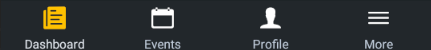
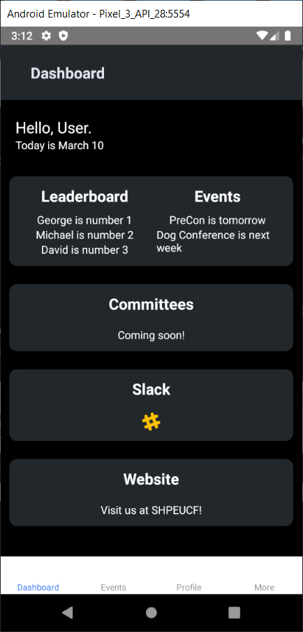
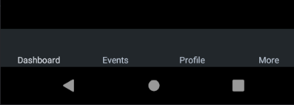
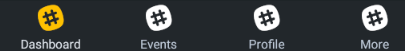
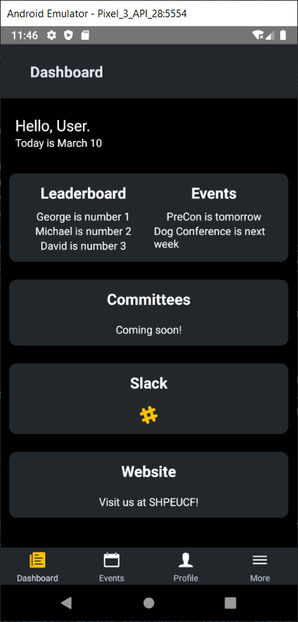

<div markdown="1" class="notice--primary">
***Preamble***  
It is assumed that the reader has some basic programming knowledge and is able to web search anything (for at least 15 minutes) that may not be explicitly written in the tutorial. The reader will be required to apply their critical thinking skills and not skip any exercises to ensure the fullest learning experience, specially since the difficulty will increase as they go on.

For reference, a link to the solutions can be found at the bottom of the page.
</div>

In Part 2, we will learn how to install additional libraries into our app. Specifically, we will install [react-native-router-flux](https://github.com/aksonov/react-native-router-flux), which is a library created to facilitate screen navigation. As shown on their GitHub, screen navigation is a way for us to connect screen togethers and be able to, well, _navigate_ through them! I have added their demo gif below.

{: width="40%" .align-center}

**So, what is the *Router* and why do we need it?**  
Right now, our app has only one simple screen, the Dashboard. However, an app usually has more than one screen and in order to do that, we need the functionality of screen navigation (which the Router provides). We will then be able to split these screens into multiple files, because it would be completely *awful* to have a ton of screens in single JavaScript file.
{: .notice--info}

{: width="40%" .align-center}

*As reference, this is what we want our screen navigation bar to look like*.
{: style="text-align: center"}

Some prep work: Create 3 new screen files called **Events**, **Profile**, and **More**. Go ahead and follow the format that you learned when making the Dashboard screen in [Part 1](./part-1). You don't need to go into styling or anything, just have their `render()` functions return an empty `View` component.

## Exercise 1
**TLDR;** Install the react-native-router-flux library and create the router file.
{: .notice}

As you learned [before](./part-1#exercise-6), you install libraries, or modules, into your app by using the command

  ```
  npm install <package name>
  ```

This adds it to the dependency list of your project. You can check out the current dependencies and their versions in the `package.json` file.

1. Install version `4.0.6` of `react-native-router-flux`:

    ```
    npm i react-native-router-flux@^4.0.6
    ```

1. Let's create the router file, this houses the implementation of the library. We could create this file anywhere, but to avoid having 50 files all in the same place, let's organize stuff. Create an `src` (short for source) folder and add the previously created files (Events.js, Profile.js, More.js) to it.

1. Inside this folder, create another folder called `config` (short for configuration), this is the folder that will contain `Router.js`, which you can create it now as well.

    This `Router.js` file will contain a function component that returns the Router component.

    A function component can come in the form of:

    ```js
    const RouterComponent = () => {
      // Imagine some fancy code here
    }
    ```

    **What the heck is a function component?**  
    A function component is another way of making a class component to render JSX elements just as we did in [Part 1, Exercise 1](./part-1#exercise-1). The main difference is that we can't modify states or the life cycle, which we haven't covered yet. The important thing is that they are simpler since we don't handle as much stuff, but because we don't use complex stuff in the Router we can take advantage of that. You can read more about functional vs class components [here](https://guide.freecodecamp.org/react-native/functional-vs-class-components/) or [go down a rabbit hole](https://www.robinwieruch.de/react-function-component). <sub>please note that we get this function component from the React.js library, which is why the second link may have different syntax from React Native</sub>
    {: .notice--info}

    For now, make your function return the Router component as a paired tag element as shown below and we'll go ahead and expand on the implementation of the router in the next exercises.

    ```js
    const RouterComponent = () => {
      return (
        <Router>
        <Router/>
      );
    }
    ```

    **Note**: Make sure that you properly import `React` and the router component from the `react-native-router-flux` library. And that you export your new function component (as we did in Part 1), otherwise you will get an error when you try to use it.
    {: .notice--warning}

## Exercise 2
**TLDR;** Add screens to the router component.
{: .notice}

The Router component makes use of some navigation components called `Stacks` and `Scenes`. Stacks allow you to group Scenes, while Scenes are the specific screens that we want to access. If you look around in the [documentation](https://github.com/aksonov/react-native-router-flux), you'll see some examples of how stacks and scenes are laid out in the code.

Similar to how we wrap our JSX elements in one "big" `View` on screens (as we did in App.js in Part 1), we wrap everything around a parent `Stack`. 

```js
<Router>
  <Stack> // parent stack
    <Stack> // first inner stack
      <Scene/> // I will make a scene (and end it)
    </Stack>
    <Stack> // second inner stack
      <Scene/> // another dramatic scene
    </Stack>
  </Stack>
</Router>
```

For this exercise, follow the [documentation](https://github.com/aksonov/react-native-router-flux) and create a `Stack` with the key `"root"` inside of your Router component. Then, within this `Stack`, place all new screens (Events, Profile, More) as individual `Scene`s.

<div markdown="1" class="notice--info">
Wait, what the fork are scenes and stacks, again?

* **Stack**: "A component to group Scenes together for its own stack based navigation" *from [Router flux](https://github.com/aksonov/react-native-router-flux/blob/master/docs/API.md#stack-stack)*.
* **Scene**: "The basic routing component for this router" *from [Router flux](https://github.com/aksonov/react-native-router-flux/blob/master/docs/API.md#scene)*.

The Stack for screen navigation can be thought of as a stack of papers, where each paper is a "deeper" screen (or `Scene`) we go into.
</div>

At the end, it should look like this:

```js
<Router>
  <Stack
    key = "root" // reference for this specific stack
    tabs // sets tabs to true, which allows for tab-based navigation
    tabBarPosition = "bottom" // specify tabBar position on the app
    type = { ActionConst.RESET } // type of navigation action, in this case reset the stack
  >
    <Scene
      key = "events" // used to call the screen transition
      hideNavBar // hide a 'top' navigation bar that is specific for scenes
      component = { Events } // name of component to be displayed
      tabBarLabel = "Events" // how you want the text to look on the navigation bar
    />
    // Additional scenes added here for Profile.js and More.js
  </Stack>
</Router>
```

<div markdown="1" class="notice--info">
**Note**: Because we are calling the screens we created, it is important that the Router imports them from their respective files, e.g.:

```js
// Assuming Router.js is in src/config and Events is in src/
import Events from "../Events.js";
```

You should also import the `Stack` and `Scene` components, and `ActionConst` since that are being used from the router-flux library.
</div>

The `key` prop in `Scene` allows us to go to that screen by using the router flux API. For example, if a scene key is `events`, we access that screen by using `Actions.events()`.

The value "ActionConst.RESET" means that whenever a new scene is called within this stack, it will fully empty the current call stack and bring up the new scene without transitioning. We'll want to change the type value in other situations in the future, but for now it's fine.

The return statement for Router.js should kinda look like this:  
```js
return (
  <Router>
    <Stack> // parent Stack
      <Scene/> // for Events.js
      <Scene/> // for Profile.js
      <Scene/> // for More.js
    </Stack>
  </Router>
);
```

For more info on these props, make sure to check out the [Router documentation](https://github.com/aksonov/react-native-router-flux).

## Exercise 3
**TLDR;** Call our new router function component inside of App.js.
{: .notice}

You've done the hard part, which is starting to build your actual router. This router will now function as the backbone of the app when it comes to screen navigation. Any new scenes you make will have to be placed inside the router strategically to be able make full use of the router APIs functionality. But more on that later. 

What do you do now if we want to see any of the changes we made? We just need to hand over the reigns of the app to the router. Before we do this though, we need to clear everything we did on App.js, because the stuff we wrote there is actually for Dashboard.js.

1. Create a new file called `Dashboard.js` in the "src" folder and copy-paste everything from App.js to it. On the new file, rename `class App` to `class Dashboard`. Rename the export statement as well.

1. Import and add the Dashboard to the Router as a scene, just like the other screens, except it should be the first Scene in the "root" stack.

1. On App.js, clear everything, leaving only an empty render function, its export statement, and the `from "react"` import statement, essentially a fresh start. Then add an an empty return statement to `render()`.

1. Import your router function component from the Router.js file.

    <div markdown="1" class="notice--info">
    **Note**: When importing components from other JavaScript files, if those components were exported as default, the following import statements would be identical.

    ```js
    import Stuff1 from "./File";
    import Stuff2 from "./File";
    ```

    Essentially, these import statements are only going to grab whatever was exported as default from the directory you indicated, so it doesn't matter what you name the import. Just remember to use the name you gave it when you call it inside your code.
    </div>

1. Once you've imported the function component , add the Router to your render function and return it as follows. This tells react native to return the function component on Router.js, which takes care of all other files we made.

    ```js
    return (
        <Router />
    );
    ```

Now when you re-render your app, you should see the tabBar at the bottom, allowing you switch between the different screens. Additionally, this permits us to use different JS files to develop our app, so we don't need to have everything on App.js!

{: width="30%" .align-center}

<div class="notice--info" markdown="1">
**Note**: You might've noticed some yellow warnings popping up in your emulator. This is because the react-native-router-flux library is still using some older react functions that are being deprecated *eventually*. For now, place the following bit of code in App.js before your App component to get rid of any yellow warnings.

```js
console.disableYellowBox = true;
```
</div>

However, the other screens we made are not that impressive, but don't worry, we will fill them up in [Part 3](/part-3). Additionally, the navigation bar is plain as shirt, so let's style it up.

## Exercise 4
**TLDR;** Styling the navigation bar.
{: .notice}

There are additional props that we didn't use before that lets us add styling and icons to each "tab," look at them [here](https://github.com/aksonov/react-native-router-flux/blob/master/docs/API.md#tabs-tabs-or-scene-tabs).

1. Let's style the `Stack`. Create a style for it, just like you did with `Dashboard.js`. It will have a backgroundColor (`#21252B`) and some padding.

1. Place the newly created style in the `Stack` prop, `tabBarStyle`. Then add two other props, which will be set to the colors we want each individual tab to look like depending if it's being selected or not

    ```js
    // Example
    activeTintColor = "#E0E6ED"
    inactiveTintColor = "#C0CCDA"
    ```

    {: width="40%" .align-center}

1. Next, we want to add an icon to each `Scene` so that it looks nicer. Since we already worked with icons before, you should have an idea on how to work with them. Import the icon you want from `react-native-vector-icons` as you did before. (Remember the [available icon sets](https://github.com/oblador/react-native-vector-icons#bundled-icon-sets) - the SHPE app uses Ionicons.)

	For this, we use the [`tabBarIcon` prop](https://reactnavigation.org/docs/bottom-tab-navigator/#tabbaricon), which accepts a function with some predefined parameters:
	* `focused` (implicitly defined in `Scene`s which tells React Native if the user is in a `Scene` or not),
	* `size` (spaced predetermined inside the tab), and
	* `color` (active and inactive tint colors predefined earlier).
	
	With this function, we will be able to set icons for each `Scene`.

1. Add the `tabBarIcon` prop to your root stack. Since this a function, we will define it here.

	This function should return an Icon component of your choosing so that the Router can add it to the navigation bar. We define this with an arrow function as follows:

	```js
	tabBarIcon = { ({ focused }) =>
		<Icon
			name = ...
			size = { 25 }
			color = ...
		/>
	}
	```

	However, this adds more code the root stack, making it more cluttered. At this time, it would be better to create an additional function inside the `RouterComponent` functional component, before the `return` statement. This function will again receive the `focused` parameter that is being passed to `tabBarIcon`, and would end up much cleaner:

	```js
	tabBarIcon = { ({ focused }) => myFunction(focused) }
	// Here, tabBarIcon uses the `focused` boolean variable,
	// which is passed to myFunction for it to use.
	```

	As a challenge, try to create the function that tabBarIcon calls with the parameter `focused`.

	<details>
		<summary>Click here for the answer</summary>

	<div markdown="1">
	```js
	// JS arrow function
	const renderIcon = (focused) => {
		return (
			<Icon
				name = ...
				size = { 25 }
				color = ...
			/>
		);
	}

	// or

	// regular JS function
	function renderIcon(focused) {
		return (
			<Icon
				name = ...
				size = { 25 }
				color = ...
			/>
		);
	}
	```
	</div>
	</details>

	So, **how** does this work?
	Since this is defined in the root `Stack`, all nested `Scene`s are passed the `tabBarIcon` prop you defined in the `Stack`. This means that now all scenes have the exact same icon and colors. Essentially, all props from the `Stack` are pasted to the `Scene`s that are nested inside the stack, unless overwritten, like `key`.
	{: .notice--info}

	A couple of things to note:
	* We pass `focused` but never use it. We need to use it so that the icons have different colors depending if the user is in a certain screen or not, this will behave similarly to the active and inactive tint.
	* All tabs have the same icon, but they should all be different.

Let's fix both of these issues.

1. We will use the famous ternary operator to use `focused` and return different colors depending on its value.

	<details>
		<summary>Short introduction to the ternary operator.</summary>

	<div markdown="1">
	
	You are already familiar with if-else branches, so the following code returns "1 is 1".

	```js
	if (1 == 1) {
		return "1 is 1";
	}
	else {
		return "1 is not 1, uh oh";
	}
	```

	Equivalently, we can use the [ternary operator](https://www.thoughtco.com/javascript-by-example-use-of-the-ternary-operator-2037394):

	```js
	//                 v if True    v if False
	return (1 == 1) ? "1 is 1" : "1 is not 1, uh oh";
	//       ^ is 1 == 1?      ^ else
	// also returns "1 is 1"
	```

	</div>
	</details>
	<br />
	Now, our color prop should check if `focused` is true. In case it is, use one color (`#FFC107`), else use another (`#FFF`).

	```js
	// Example
	color = { focused ? "#FFC107" : "#FFF" }
	//      ^ Notice that we wrap it in curly braces,
	//        so that react native knows we're inserting JS code
	```

	On re-rendering your app, you will see the color of the icons change accordingly, however we still need to change the fact that they are all the same icons.

	{: width="50%" .align-center}

2. We need a way of saving the icon name for each different `Scene`. This is simple: we can just add a new prop to each component called `icon`.

	Since each `Scene` gets a copy of `tabBarIcon`, we just need to pass a new parameter, the `icon`. This new prop will be a string of the icon's name from the `react-native-vector-icons` library.

	Go ahead and this new prop for all four scenes, the values for Dashboard, Events, Profile, More, are (respectively):

	* `icon = "ios-paper"`
	* `icon = "ios-calendar"`
	* `icon = "ios-person"`
	* `icon = "ios-menu"`

	**Remember** that you can find other icons in the [database for the icons library](https://oblador.github.io/react-native-vector-icons/).
	{: .notice--info}

3. Add the icon parameter to the `tabBarIcon` function and to the custom function, `renderIcon`, we created previously. Since it's more than one parameter, remember to separate them by a comma.

4. In the `renderIcon` function, remove the hard-coded name you had for the `Icon` component and replace it with the parameter received, `icon`. This is done by, again, using curly braces since we're inserting JavaScript in the JSX element.

	```js
	// Example
	name = { icon }
	```

If the `icon` prop was set correctly, the navigation bar should now have different icons for each tab, as we wanted.

{: width="40%" .align-center}

***
**[Solutions](https://github.com/SHPEUCF/shpeucf.github.io/tree/master/solutions)**
