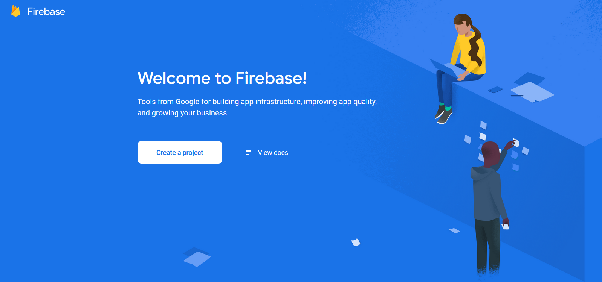
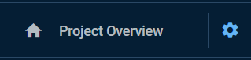

<div markdown="1" class="notice--primary">
***Preamble***  
It is assumed that the reader has some basic programming knowledge and is able to web search anything that may not be explicitly written in the tutorial.

For reference, a link to the solutions can be found at the bottom of the page.
</div>

So now we can touch a bit of the backend by setting up Firebase and then use their API to add and retrieve data that can be used to save user data, events, roles, and a bunch of other stuff with their realtime database. Let's get started.

<div markdown="1" class="notice--info">
**What's Firebase?**  
"In a nutshell, Firebase is an ecosystem of Google tools that can be used to make full-stack, scalable applications in the Google Cloud (called Cloud Firestore) or Realtime Database. It’s categorized as a backend-as-a-service (or BaaS) which gives developers the opportunity to create applications without the hassle of setting up the backend..." - *from [Quora](https://www.quora.com/What-is-firebase?share=1) [@Fahim-ul-Haq](https://www.quora.com/profile/Fahim-ul-Haq)*

Essentially, it will help us tremendously with the backend without having to create any API endpoints ourselves to handle data from users.
</div>

## Exercise 1
**TLDR;** Create a Firebase project and database.
{: .notice}

1. Navigate to [firebase.google.com](https://firebase.google.com/) and sign in or create a new Google account.

1. You will be taken to the Firebase account overview. Here you can create a new project by clicking **Create a project**. Once there, enter your project name and enable or disable Google Analytics (not useful/needed for this small project). If you enable it, you'll need to link your Google Analytics account.

	{: width="80%" .align-center}

1. After creating it, you should be at the project overview page. Now we can create the actual database, which will house all of our data. To do so, click on **Develop**, found on the left sidebar and then click on **Database**.

	{: width="35%" .align-center}

	<div markdown="1" class="notice--info">
	**What's a database?**  
	"A database is an organized collection of structured information, or data, typically stored electronically in a computer system." - *from [Oracle](https://www.oracle.com/database/what-is-database.html)*

	This is where the actual data will be stored and can be referenced later on in the code.
	</div>

1. Create a [realtime database](https://firebase.google.com/docs/database) instead of a Cloud Firestore database, which you'll find by scrolling down. We use the realtime database because it is simpler and lighter, plus we can use it straight away as the database is represented with JSON, you can read more about it [here](https://firebase.google.com/docs/database/rtdb-vs-firestore?authuser=0). For our case, the **test mode** should be okay. All this does is add rules for read+write access to the database, while we would have to add them ourselves in the locked mode, which we don't care for right now.

	{: width="70%" .align-center}

	**Hol up, what's JSON?**
	JSON or JavaScript Object Notation is just "syntax for storing and exchanging data," [*W3Schools*](https://www.w3schools.com/js/js_json_intro.asp). It allows us to have text with JavaScript notation, meaning that we can have structures such as arrays or objects that can be used with our JavaScript code.
	{: .notice--info}

1. This will take you to the empty (or null) database for your project. It doesn't look like much now, but it slowly starts to unfold as you keep adding data. To have some data, let's add one. Hover over the database name, you will see a `+` icon. Click on it and add a `name` and `value`, then click **Add** or press the enter key.

	The new field will be highlighted green letting you know it's new, while its parent (the database name) will be highlighted yellow, indicating that something updated.

	{: width="80%" .align-center}

As you continue building your project and more data is added, it will start to get "bushy," just like a tree.

{: width="30%" .align-center}
_Extracted from [Coding Infinite](https://codinginfinite.com/realtime-moving-cars-google-maps-javascript-firebase/)_
{: style="text-align: center; font-size: 14px"}

We can now move on and set up other parts of Firebase so that we can connect it to the app on [exercise 3](#exercise-3).

## Exercise 2
**TLDR;** Add the web app on Firebase.
{: .notice}

1. Go to **project settings**, here you will see your project details and other information related to your project.

	| {: .align-center} | {: width="80%" .align-center} |

1. You'll also see a section titled "Your apps" on the same **General** tab at the bottom of the screen. Let's add React Native as an app so that we can link them and use the API functions Firebase provides. On "Your apps," click on the third icon (left to right) to add our web app, React Native.

	{: width="35%" .align-center}

1. Create an app nickname to and register it. Note that there's no need to enable hosting since we won't be using it.

	You'll get some code that we will use to connect our React Native app with the database. For now, continue to the console, where the code and app nickname will be displayed as part of the web app. Keep this in the background as we will use the config data in the next exercise.

## Exercise 3
**TLDR;** Install Firebase and connect it to our app.
{: .notice}

We now switch gears and go back to react native.

1. Let's install the firebase module on our app, just like we've done before:

	```
	npm i firebase
	```
	
	And that's it, let's go to [Part 4](./part-4). (just kidding)

1. We now have to import firebase in order to use it, just like we've done previously, except this time it's a bit different since `firebase` is not a component. Following their [documentation](https://firebase.google.com/docs/web/setup#node.js-apps), import firebase on `App.js`:

	```
	import * as firebase from "firebase/app";
	import "firebase/database";
	```

1. Go back to Firebase and get the web app configuration we created in [exercise 2](#exercise-2). As a reminder this is found in **Project settings**, under "Your apps" in the **General** tab. Copy and past the `Config` Firebase SDK snippet and paste it as a global constant, before the definition of the class component.

	```js
	// It looks something like this
	const firebaseConfig = {
		apiKey: "key",
		authDomain: "domain",
		databaseURL: "url",
		projectId: "awesome-app-de322",
		storageBucket: "awesome-app-de322.appspot.com",
		messagingSenderId: "senderid",
		appId: "id"
	};
	```

	**Warning**: This is definitely not the ideal way to do this since anyone with access to that configuration and modify your database as they wish, especially since we allowed the database to be accessed by anyone. However, it is more than fine for this tutorial as we will not be handling anything of importance.
	{: .notice--warning}

1. Initialize Firebase by using the `initializeApp()` method, which takes in the configuration we got from the previous step.

	```js
	firebase.initializeApp(firebaseConfig);
	```

	This can be done anywhere *inside* the class, but we should do it the correct way. Add a new method called `componentDidMount` before `render` inside the `App` class.

	**Why call it componentDidMount and what does it do?**  
	`componentDidMount` is a lifecycle method part of the React Native framework that allows us to run parts of the code at different times, although we don't get to choose in which order.
	{: .notice--info}

	<details>
		<summary>Mini introduction to the lifecycle methods</summary>

	<div markdown="1">
	Lifecycle methods are the methods called by default when executing a React or React Native project. There are a couple of them, but the most important ones are (and note the order in which they're run in):

	1. `constructor()`, called before the component is mounted
	1. `render()`, mounting of the component, aka rendering all JSX elements
	1. `componentDidMount()`, called after rendering everything

	To learn more about the lifecycle methods and when to use them, click [here](https://reactjs.org/docs/react-component.html).
	</div>
	</details>
	<br />
	That is, in the end we will have something like this:

	```js
	// import statements
	
	// firebaseConfig
	
	export default class App extends Component {
		componentDidMount() {
			firebase.initializeApp(firebaseConfig);
		}

		render() {
			...
		}
	}
	```

Once initialized, we can use the API functions provided by Firebase for the realtime database, found [here](https://firebase.google.com/docs/database/web/read-and-write). In the next exercise, we'll push some data to the database to see if everything is working properly. Then in [part 4](./part-4), we can create some additional screens to create users and log them in (functionality will be added in [part 5](./part-5)!

## Exercise 4 (Optional)
**TLDR;** Test Firebase (the bad way).
{: .notice}

The goal here is to test if we configured firebase correctly in our app plus see how it behaves when we add some data to it.

1. Open the realtime database and have it as a background so you can see the final product at the end of this exercise.

1. Let's do everything in `componentDidMount` and hard-code some values that are going to be passed to the `set` method for Firebase. It is a really bad of doing it, but it'll be fun to see how the database changes live and we get to check if we finished part 3 successfully.